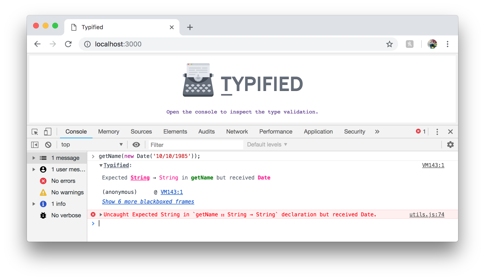

> An experimental implementation of first class functional types using pure ES at runtime, inspired by [Haskell](https://www.haskell.org/), [PureScript](http://www.purescript.org/) and [Idris](https://www.idris-lang.org/).


&nbsp;

&nbsp;

&nbsp;

&nbsp;
[](https://github.com/prettier/prettier)

**npm**: `npm install typified --save`
<br />
**cdn**: [`https://cdn.jsdelivr.net/npm/typified@latest/src/index.js`](https://cdn.jsdelivr.net/npm/typified@latest/src/index.js)

## Getting Started

With Typified you introduce JavaScript to the world of strong typing in a functional fashion. Instead of the Java-style typing that [TypeScript](https://www.typescriptlang.org/) and [Flow](https://flow.org/) provide, Typified takes the [Haskell](https://en.wikipedia.org/wiki/Haskell_(programming_language)#Code_examples)-inspired approach where types are kept entirely separate from their associated values.

```javascript
import ꓽ from 'typified';

const sayHello =
    t`sayHello ∷ String → String` (name => `Hello ${name}!`);
```

By invoking `sayHello` with a `String` we're guaranteed to be returned a `String` otherwise Typified will throw a `TypeMismatchError` that will notify the developer of such an occurrence. Passing in anything other than `String` will throw the mismatch error.

Typified tries to stay close to the JavaScript world, and thus allows specifying the union operator (`|`) to accept multiple types. For instance our `sayHello` function could take a `Number` type as well and be perfectly fine, as it's not performing any `String`-specific operations &ndash; thus we could augment the types to allow `Number` to be passed too.

```javascript
const sayHello =
    t`sayHello ∷ String|Number → String` (name => `Hello ${name}!`);
```

Invoking `sayHello` with a `Number` type would be just as fine as invoking it with a `String`.

Typified also supports to the concept of [generics](https://en.wikipedia.org/wiki/Generic_programming). Below we have modified the function a little to accept two name parameters, which yields either one or two greetings depending on whether the names are the same.

```javascript
const sayHello =
    t`sayHello ∷ String → String → String` ((first, second) => {
        return first === second
            ? `Hello ${first}!`
            : `Hello ${first} & ${second}!`;
    });
```

We've removed the `Number` type constraint as we always want to compare `String` types with each other. Invoking `sayHello` as `sayHello('Adam', 100)` would be somewhat pointless as a `String` and `Number` can **never** match with strict equality. However we're still performing a non-`String` exclusive operation, and therefore being able to pass a `Number` would still be rather useful.

You might be tempted to define the type as `String|Number → String|Number → String` however that would still allow the passing of a `String` and a `Number` at the same time. What we need is a way to enforce **any** type as long as both match &ndash; generics suddenly become a useful tool.

```javascript
const sayHello =
    t`sayHello ∷ ∀ a. a → a → String` ((first, second) => {
        return first === second
            ? `Hello ${first}!`
            : `Hello ${first} & ${second}!`;
    });
```

Using generics we have the above type annotation which takes a generic `a` &ndash; the `a` doesn't yet have a concrete type, and will instead assume a concrete type when the function is invoked. Passing a `Number` as `firstName` would cause `a` to be of type `Number`, and therefore ensure that `secondName` is also a `Number`. Likewise passing `String` as the first parameter would give `a` a type of `String`.

You can define as many generics as you wish in the type annotation, but it's crucial that you define them using `∀` or `forall` as otherwise the types would be assumed to be concrete types. In Haskell it's perfectly valid to not define generics, whereas in [PureScript](http://www.purescript.org/) the defining of generics is mandatory &ndash; Typified also takes this approach.
